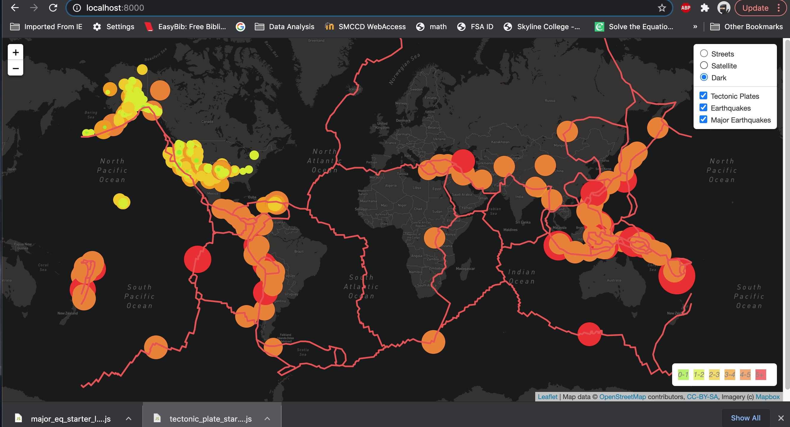
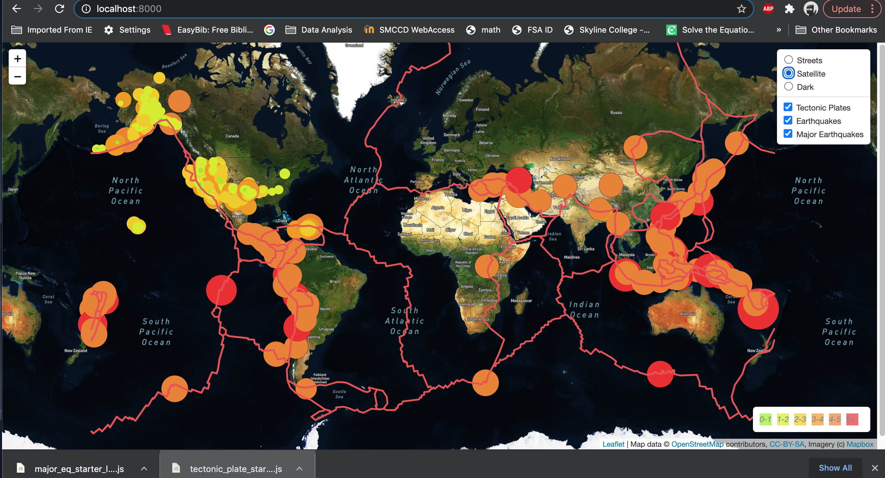
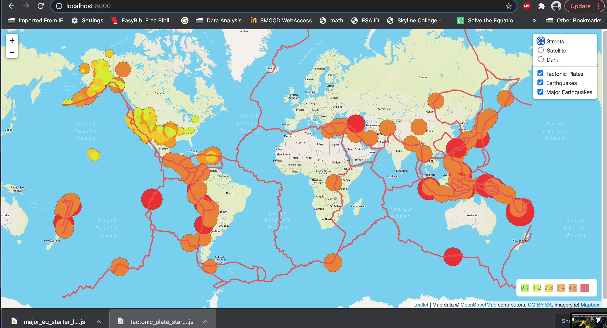

# Mapping_Earthquakes
## Tasks
To complete this project, use a URL for GeoJSON earthquake data from the USGS website and retrieve geographical coordinates and the magnitudes of earthquakes for the last seven days. Then add the data to a map.
## Approach 
To use the JavaScript and the D3.js library to retrieve the coordinates and magnitudes of the earthquakes from the GeoJSON data. You'll use the Leaflet library to plot the data on a Mapbox map through an API request and create interactivity for the earthquake data.
## Deliverable
Deliverable 1: Add Tectonic Plate Data

Deliverable 2: Add Major Earthquake Data

Deliverable 3: Add an Additional Map

